<div align="center">



<br><br>

[](https://github.com/features/actions)
[](https://nodejs.org/)
[](LICENSE)

---

</div>

Track how many GitHub API requests a workflow job consumes, parttioned by bucket (core, GraphQL, search, etc.).

This action captures the rate-limit state at job start and compares it with the state at job end.

## Usage

To use this action, just drop it in anywhere in your job - the pre- and post-job hooks will do all of the work. (CAVEAT: See "Reset Windows" section below for a nuance.)

```yaml
jobs:
  search:
    runs-on: ubuntu-latest
    steps:
      - name Checkout
        uses: actions/checkout@v4
      - name Track Usage
        uses: hesreallyhim/github-api-usage-tracker@v1
      - name: Query API
        uses: actions/github-script@v6
        with:
          script: |
            const response = await ...
      ...
```

After your job completes, you'll get a nice summary:

<div align="center">
  
</div>

## Inputs

| Name        | Description                                                                                                            | Default                       |
| ----------- | ---------------------------------------------------------------------------------------------------------------------- | ----------------------------- |
| token       | Name of GitHub token used to query rate limits                                                                         | github.token (`GITHUB_TOKEN`) |
| buckets     | Comma-separated list of rate-limit buckets to track.<br>(core, search, graphql...) - see reference below for full list | core,search,graphql           |
| output_path | Write usage report JSON to this path (empty to disable)                                                                | github_api_usage.json         |

## Outputs

| Name                                    | Description                                                         |
| --------------------------------------- | ------------------------------------------------------------------- |
| `total`                                 | Summation of captured queries/points used per bucket                |
| `duration_ms`                           | Duration between first and last snapshot in milliseconds            |
| `crossed_reset`                         | True if the snapshots crossed the rate-limit reset time (see below) |
| `buckets_data`                          | Object keyed by bucket name with per-bucket usage data              |
| `buckets_data.<bucket>`                 | Usage data for a specific bucket                                    |
| `buckets_data.<bucket>.used`            | Used counts for the bucket (start, end, total)                      |
| `buckets_data.<bucket>.used.start`      | Used count at the start snapshot (limit minus remaining)            |
| `buckets_data.<bucket>.used.end`        | Used count at the end snapshot (limit minus remaining)              |
| `buckets_data.<bucket>.used.total`      | Used during the job (minimum if crossed_reset is true)              |
| `buckets_data.<bucket>.remaining`       | Remaining counts for the bucket (start, end)                        |
| `buckets_data.<bucket>.remaining.start` | Remaining count at the start snapshot                               |
| `buckets_data.<bucket>.remaining.end`   | Remaining count at the end snapshot                                 |
| `buckets_data.<bucket>.crossed_reset`   | True if the bucket's reset window was crossed                       |

Example output:

```json
{
  "total": 60,
  "duration_ms": 12345,
  "crossed_reset": false,
  "buckets_data": {
    "core": {
      "used": { "start": 5, "end": 50, "total": 45 },
      "remaining": { "start": 4995, "end": 4950 },
      "crossed_reset": false
    },
    "graphql": {
      "used": { "start": 0, "end": 10, "total": 10 },
      "remaining": { "start": 5000, "end": 4990 },
      "crossed_reset": false
    },
    "search": {
      "used": { "start": 0, "end": 5, "total": 5 },
      "remaining": { "start": 30, "end": 25 },
      "crossed_reset": false
    }
  }
}
```

## Notes

### General

- This action uses pre- and post-job hooks to "snapshot" the rate-limit as returned by the `/rate-limit` endpoint. Querying this endpoint does _not_ itself count against the primary rate limit.
- Detailed logs are emitted via `core.debug()`. Enable workflow debug logging to view them (or set a `ACTIONS_STEP_DEBUG` or `ACTIONS_RUNNER_DEBUG` repository secret/variable to `true`).
- Output is set in the post step, so it is only available after the job completes - if you want to track usage across jobs, just use the action in both jobs and aggregate the results (although this may be less reliable due to "noise" from other workflows).

### Bucket Types

- GitHub applies different rate limits to different API "buckets". This action tracks usage across different bucket types. The list of bucket types comprises: core, search, code_search, graphql, integration_manifest, dependency_snapshots, dependency_sbom, code_scanning_upload, actions_runner_registration, source_import.
- Although this is undocumented, requests to `core` may _also_ appear in the `code_scanning_upload` bucket when querying the `/rate-limit` endpoint.

### Token Types

- GitHub’s primary rate limit for Actions using the `GITHUB_TOKEN` is 1,000 REST API requests per repository per hour (or 15,000 per repository per hour for GitHub Enterprise Cloud).
- If you set the `token` to be a PAT, or something besides `GITHUB_TOKEN`, that token has the same rate-limit in the Action as it does elsewhere (and rate-limit "snapshots" will be impacted).
- Despite appearances, `GITHUB_TOKEN` is an ephemeral token that is minted at the start of each job, as an app installation token from the GitHub Actions app. However, the same _rate limit_ applies to any job within the repo, even though the tokens are, strictly speaking, non-identical.
- For this reason, the API usage measurements can only be considered precise if there is _no other job_ running concurrently with the action that you wish to track. This is also why the rate limit starting snapshot may already show non-0 usage data.

### Reset Windows (Advanced Usage)

- GitHub's primary rate limits appear to use fixed windows with reset times anchored to the first observed usage of the token (per resource bucket), rather than a rolling window, wherein the rate limit is "replenished" as time passes. For `core`, e.g., this is 60 minutes from the first usage within an action.
- If the execution of a job crosses over this reset time, the "Used" value returned by querying the `/rate-limit` endpoint is _reset_ to 0 (and, similarly, "Remaining" is reset to the bucket-maximum).
- For this reason, given the "snapshot" design of this action, total usage _cannot_ accurately be reported - any API usage that is consumed between the start of the job and reset time is effectively lost, and the final snapshot will only reflect the usage _since_ the time of reset.
- If this happens, the Action Summary will report that a reset window has been crossed, and that usage figures can only reflect a lower bound, or minimum. Usage tracking that is accurate across a reset window can only be achieved by tracking individual requests.
- As a partial solution, the step in which the Action is used also captures a "mid-job" snapshot; so, if you have a job that involves API usage in multiple steps, then placement of the Action does make a difference, and you should place the Action in between those steps. If the mid-job snapshot happens _after_ the earlier API calls but _before_ the reset time, that usage data will also be reported. This is meant as a convenience, or a patch - it should not be considered a reliable solution to the problem just described.

---

<div align="center">

## License

MIT © 2026 Really Him

</div>
